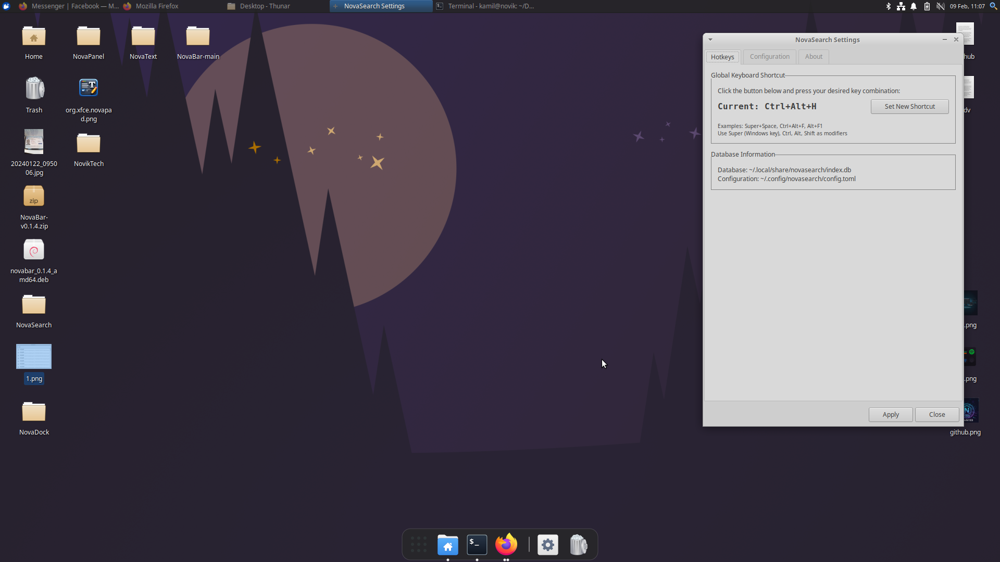
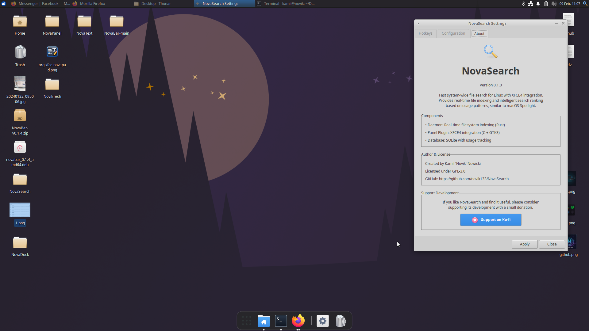
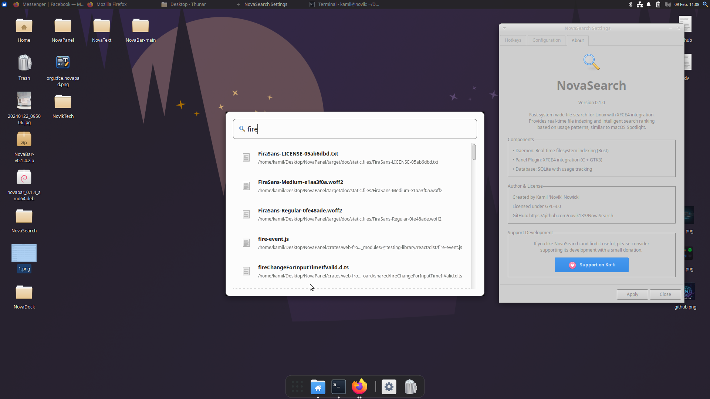

[](https://ko-fi.com/novadesktop)

# NovaSearch

NovaSearch is a high-performance, system-wide file search utility designed for Linux with native XFCE4 integration. It implements real-time file indexing and a weighted search ranking algorithm. The system provides application discovery across multiple packaging formats and a centralized launching interface.

## Screenshots

<p align="center">
  
</p>

<p align="center">
  
  
  
</p>

## Features

* **Asynchronous Indexing**: Monitors filesystem events via the inotify kernel subsystem.
* **Database Backend**: Optimized SQLite storage for rapid query execution and metadata persistence.
* **Application Discovery**: Automated indexing of binaries and desktop entries from APT, Snap, Flatpak, and AppImage sources.
* **UI Framework**: GTK3-based search interface with XFCE4 panel plugin compatibility and system theme inheritance.
* **Input Management**: Integrated configuration GUI for interactive keyboard shortcut mapping.
* **Ranking Algorithm**: Prioritizes results based on frequency of access and usage telemetry.
* **CLI Interface**: Command-line tools for daemon management and manual index control.

## Performance Benchmarks

Statistics derived from a production environment containing approximately 200,000 indexed objects:

| Metric | NovaSearch Daemon | Context / Comparison |
| :--- | :--- | :--- |
| **Physical RAM (RSS)** | ~48.6 MB | Idle state (post-indexing) |
| **Peak Memory** | ~75.9 MB | Active heavy indexing operations |
| **Indexing Throughput** | ~5,000 files/sec | 25,000 files processed in ~5s |
| **Database Footprint** | 93 MB | Storage for 188,360 records |
| **CPU Utilization** | < 0.1% | Background monitoring state |

NovaSearch exhibits up to 70% lower memory consumption compared to GNOME Tracker or macOS Spotlight in similar environments.

## Version

**Current Version**: 0.1.0

## Quick Start

### Installation (Debian Package)

1. **Build and install**:
   ```bash
   ./build-deb-manual.sh
   sudo dpkg -i novasearch_0.1.0-1_amd64.deb
2. **Initialize Service**:
   ```bash

    systemctl --user enable --now novasearch-daemon

3. **Panel Integration**:
      Right-click XFCE4 panel -> Panel -> Add New Items -> NovaSearch.

4. **Execution**:
      Invoke the search window via Super+Space (default) and input queries.

**Project Structure**

novasearch/
├── daemon/                # Rust indexing daemon
│   ├── src/
│   │   ├── main.rs        # Entry point and CLI handler
│   │   ├── config.rs      # Configuration parser
│   │   ├── database.rs    # Persistence layer (SQLite)
│   │   ├── scanner.rs     # Initial filesystem traversal
│   │   ├── watcher.rs     # inotify event handling
│   │   └── paths.rs       # Path normalization utilities
│   └── Cargo.toml
├── panel/                 # GTK3/C XFCE4 panel plugin
│   ├── src/
│   │   ├── main.c         # UI and desktop entry integration
│   │   └── database.c     # Client-side database interface
│   └── meson.build
├── debian/                # Debian packaging metadata
├── build-deb-manual.sh    # Automated build script
└── README.md

**Dependencies**
Build Dependencies

    Rust toolchain (≥ 1.70)

    GCC / Clang

    Meson (≥ 0.59) & Ninja

    pkg-config

Development Libraries

    GTK3 (≥ 3.22)

    SQLite3 (≥ 3.0)

    libxfce4panel (≥ 4.12)

    libxfce4ui

    keybinder-3.0

**Installation Commands (Debian/Ubuntu)**
```bash

sudo apt update
sudo apt install build-essential rustc cargo meson ninja-build pkg-config \
  libgtk-3-dev libsqlite3-dev libxfce4panel-2.0-dev libxfce4ui-2-dev \
  libkeybinder-3.0-dev
```
**Configuration**

Configuration is managed via ~/.config/novasearch/config.toml.

***Indexing Parameters***

[indexing]
include_paths = ["/home/user"]
exclude_patterns = [".*", "*.tmp", "*.log"]

Application paths (e.g., /usr/share/applications) are indexed by default.

***Resource Constraints***
[performance]
max_cpu_percent = 10
max_memory_mb = 100
flush_interval_ms = 1000

***Usage***

Daemon CLI

    novasearch-daemon status: Returns current indexing state.

    novasearch-daemon reindex: Triggers a full database refresh.

    journalctl --user -u novasearch-daemon -f: Monitors daemon logs.

Application Discovery

The daemon automatically parses .desktop files from:

    System paths: /usr/share/applications, /usr/local/share/applications.

    User paths: ~/.local/share/applications.

    Formats: Snap, Flatpak, AppImage (common locations).

Troubleshooting
Indexing Failures

If the database contains no records, execute:
```bash

novasearch-daemon reindex
sqlite3 ~/.local/share/novasearch/index.db "SELECT COUNT(*) FROM files;"
```
UI Unresponsiveness

Verify the keyboard_shortcut value in config.toml or restart the panel:
```bash

xfce4-panel --restart
```
***License***

GPL-3.0

***Author***

Created by Kamil 'Novik' Nowicki

    GitHub: https://github.com/novik133

    Project: https://github.com/novik133/NovaSearch

***Support***

Development support via Ko-fi: https://ko-fi.com/novadesktop
